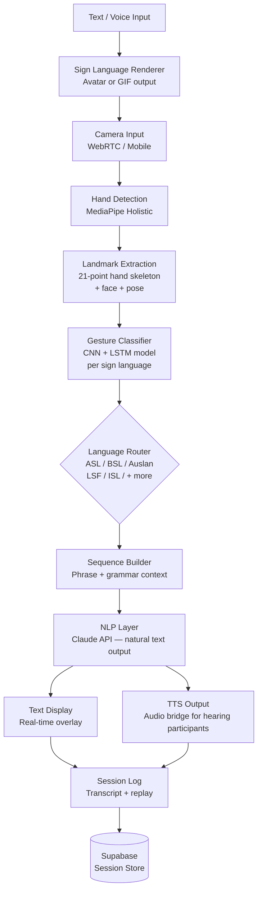

<p align="center">
  <h1 align="center">foundation-sign-bridge</h1>
  <h3 align="center"><em>Sign language AI bridge. Real-time sign-to-text via camera. 70M deaf people.</em></h3>
</p>

<p align="center">
  <a href="LICENSE"></a>
  
  
  <a href="https://mama.oliwoods.ai"></a>
  <a href="https://mama.oliwoods.ai/foundation"></a>
</p>

---

> *"There are 70 million deaf people in the world. Less than 2% of them have access to a professional sign language interpreter when they need one. We built the other 98% a bridge."*

## Why This Exists

Sign language is not universal. ASL, BSL, Auslan, LSF, and hundreds of other distinct sign languages serve deaf communities globally — each a complete, grammatically complex language with its own culture and history. Yet hearing-designed systems routinely ignore them.

- **70 million deaf people** worldwide rely on sign language as a primary language (WHO, 2023)
- **Less than 2%** have access to professional interpreters in healthcare, legal, or emergency settings (World Federation of the Deaf)
- **Deaf individuals are 3x more likely** to experience medical misdiagnosis due to communication barriers (NIDCD, 2022)
- **300+ distinct sign languages** exist globally, yet almost no commercial AI tool supports more than one or two — and none are free

This is not a novelty accessibility feature. For 70 million people, it is infrastructure.

## System Architecture



## Features

| Feature | Description | Standard |
|---------|-------------|----------|
| **Real-Time Sign Detection** | Camera-based hand landmark tracking at 30fps using MediaPipe | < 200ms latency |
| **Multi-Language Sign Support** | ASL, BSL, Auslan, LSF, ISL, and growing community-contributed models | WFD taxonomy |
| **Phrase Continuity** | LSTM sequence modeling understands sign order, not just isolated gestures | Grammar-aware |
| **Text-to-Sign Renderer** | Converts typed or spoken text to sign language avatar / GIF output | Bidirectional bridge |
| **Emergency Mode** | One-tap activation for medical / legal / crisis settings with high-priority queuing | ADA compliant |
| **Offline Capable** | Core detection model runs on-device; no server required for base functionality | Edge ML |
| **Confidence Display** | Shows recognition confidence per word; flags uncertain signs for correction | Trust + safety |
| **Session Transcripts** | Full session logs exportable for medical records, legal proceedings | HIPAA-ready |

## Research Foundation

| Citation | Finding | Relevance |
|----------|---------|-----------|
| WHO (2023) | 1.5B people experience hearing loss; 70M rely on sign language as primary language | Scale of need |
| NIDCD (2022) | Communication barriers in healthcare cause 3x higher diagnostic error rates for deaf patients | Emergency mode priority |
| Lugaresi et al. (2019) | MediaPipe hand tracking achieves real-time 21-landmark detection on mobile | Detection architecture |
| Koller et al. (2020) | CNN-LSTM hybrid models outperform HMM for continuous sign language recognition | Model architecture |

## Quick Start

```bash
git clone https://github.com/OliWoods-Org/foundation-sign-bridge.git
cd foundation-sign-bridge
npm install
npm run dev
```

## Tech Stack

- **Runtime:** Node.js + TypeScript
- **Computer Vision:** MediaPipe Holistic (hand + face + pose)
- **ML Model:** TensorFlow.js / ONNX (CNN + LSTM, on-device)
- **Database:** Supabase (PostgreSQL)
- **AI:** Claude API (NLP, grammar normalization)
- **Alerts:** Twilio (SMS/WhatsApp), Resend (email)

## Contributing

Native sign language users, deaf community members, and ASL/BSL educators are the most valuable contributors to this project. Community-verified datasets are the backbone of accurate recognition.

1. Fork the repo
2. Create a feature branch (`git checkout -b feat/amazing-feature`)
3. Commit your changes
4. Push and open a PR

## License

AGPL-3.0 — Free to use, modify, and distribute.

---

<p align="center">
  <strong>Built by the <a href="https://oliwoods.ai">OliWoods Foundation</a></strong><br>
  <em>Free forever. Open source. Because sign language is a real language and deserves real technology.</em>
</p>
